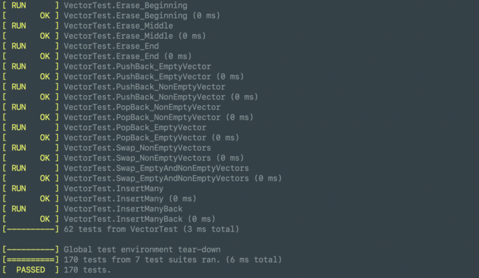

# s21_containers


This project is part of the curriculum of [School 21](https://21-school.ru/).
As part of this project, we developed a standard C++ STL library from scratch, including sequential, associative, and derived containers. This educational project enhanced our team development skills, architecture design prior to implementation, taught us how to work with templates in C++, and solidified our object-oriented programming skills.

Russian version of README you can find [here](./README_RUS.md)


## Contents

1. [Contributors](#contributors)
2. [Getting started](#getting-started) \
   2.1. [Prerequisites](#prerequisites)  
   2.2. [Steps to install and useful commands](#steps-to-install-and-useful-commands)
3. [Technical specifications](#technical-specifications)
4. [Test results](#test-results)
5. [The containers of the Standart Template Library(STL)](#the-containers-of-the-standart-template-library)


## Contributors

|                       <center> Member </center>                             |              Area of ​​responsibility         |
|-----------------------------------------------------------------------------|--------------------------------------------|
| [](https://github.com/sheritsh)<br /> <center>[// sheritsh](https://github.com/sheritsh)</center> | [vector](./src/s21_containers/vector/) <br /> [array](./src/s21_containersplus/array/) <br /> |
| [](https://github.com/YaBear)<br /> <center>[// bradamar](https://github.com/YaBear)</center>| [deque](./src/s21_containers/deque/) <br /> [list](./src/s21_containers/list/) <br /> [queue](./src/s21_containers/queue/) <br /> [stack](./src/s21_containers/stack/) |
| [](https://github.com/rodion-21-kzn)<br /> <center>[// oznakban](https://github.com/rodion-21-kzn)</center>| [AVLTree](./src/s21_containers/AVLTree/) <br /> [set](./src/s21_containers/set/) <br /> [map](./src/s21_containers/map/) |
| [](https://github.com/)<br /> <center>[// melodiea](https://github.com/)</center>| - Project and code supporting <br /> - Developments on vector and list <br /> - [Test coverage](./src/tests/) |

## Getting Started

### Prerequisites

Please install the following software before starting development:

- [Git](https://git-scm.com/downloads)
- [GCC compiler](https://gcc.gnu.org/)
- [make Utility](https://www.gnu.org/software/make/)

### Steps to install and useful commands

- Clone [repository](./)
- Run `make` - to build project and run tests
- `make check_style` - to check source code for Google Style
- `make leaks` / `make valgrind` - to check project for leaks and right memory access

If you wanna include 's21_containers.h' or 's21_containersplus.h' remember to use s21 namespace before containers. <br /><br />
__Example:__
```C++
s21::array<int, 5> arr = {1, 2, 3, 4, 5};
```

## Technical specifications

1. __Programming Language and Compiler:__
- Implement the program in C++17.
- Use the GCC compiler for compilation.
2. __Code Organization:__
- Organize the program code within the src folder.
3. __Coding Style:__
- Adhere to the Google coding style guidelines for consistency and readability.
4. __Namespace and Templates:__
- Implement classes within the s21 namespace.
- Use template classes for container implementations to support different types.
5. __Container Classes:__
- Implement container classes: list, map, queue, set, stack, and vector.
- Provide standard constructors (default, copy, move, with initialization list).
- Implement methods for accessing, modifying, and managing container elements.
- Include methods to check if a container is full or empty.
6. __Iterators:__
- Implement iterators for each container class.
- Provide begin() and end() methods to access iterators.
- Implement iterator operations: *iter, ++iter, --iter, iter1 == iter2, iter1 != iter2.
7. __Unit Testing:__
- Develop comprehensive unit tests using the GTest library.
- Ensure test coverage for all container methods and edge cases.
8. __STL Logic and Exception Handling:__
- Follow the logic of the Standard Template Library ([STL](#the-containers-of-the-standart-template-library)) for checks, memory handling, and behavior in abnormal situations.
- Implement appropriate exception handling for error scenarios.
9. __s21_containers.h Library:__
- Implement the s21_containers.h header file.
- Create separate header files (e.g., s21_list.h, s21_map.h) for each container class implementation.
- Base the implementation on classical container paradigms, with flexibility in algorithm choices.
10. __Makefile:__
- Provide a Makefile to compile and test the library.
- Include targets for cleaning (clean) and testing (test).
11. __s21_containersplus.h Library (Bonus):__
- Implement the s21_containersplus.h header file for additional container classes.
- Include classes: array and multiset.
- Base implementation on classical paradigms, allowing algorithm customization.
12. __Insert_many Method (Bonus):__
- Extend container classes with specified insert_many methods.
- Implement the method variations for different containers as indicated in the table.
- Support variable numbers of parameters using the parameter pack construct.
13. __Documentation and Comments:__
- Provide clear and concise code comments to explain the functionality and logic.
- Include necessary documentation for container classes and methods.
14. __Testing and Validation:__
- Thoroughly test all implemented classes and methods for correctness and efficiency.
- Include boundary tests and edge cases in the testing suite.
15. __Final Deliverables:__
- Submit the complete project, including source code, header files, Makefile, and test suite.

## Test results

Using the Google Test Framework, all containers and their methods, including error handling, were covered with tests. This ensures comprehensive test coverage for the code and guarantees proper program behavior, including correct error handling. Excellent work in adopting such an approach!



## The containers of the Standart Template Library


